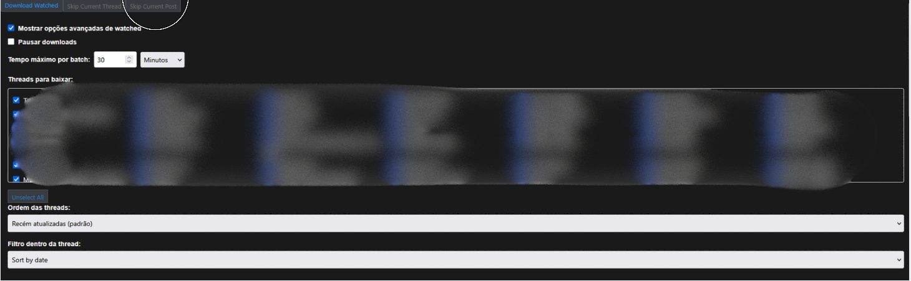

# How to Use

1. Install the Tampermonkey extension in your browser.
2. Open the userscript from the [project repository](https://github.com/batatinhafcbatatinha-pixel/ForumPostDownloader/blob/main/dist/build.user.js), copy its contents, and add it to Tampermonkey.
3. In Tampermonkey settings, set **Configuration Mode** to **Advanced**.
4. Set **Download Mode** to **Browser API**.
5. Open a watched thread on your forum and wait while the script scans all of its pages. Once the scan is complete, the download options will appear.

# File Server Option

The file server option prevents the script from downloading files that already exist on your computer.

Its behavior depends on the **Sort within Thread** setting:

- **Sort by Date:** The script checks every file in the thread. Existing files are skipped, and files that are not on your computer are downloaded. If the script finds 20 duplicate files, it skips the current thread and moves to the next one.
- **Sort by Reaction Score:** The script also checks which files already exist, but it does not skip the thread after finding duplicates. It attempts to process every file in the thread.

## Setting Up the File Server

1. Clone or download `media_sync_server.py`.
2. Open a terminal and run the script with the folder where your browser saves downloaded files. For example:

   ```powershell
   python media_sync_server.py --root "C:\Users\user\Downloads\"
   ```

3. Keep the server running before you start downloading. You can also start it again by clicking the download button.

## Notes

- This script works with both SimpCity and SocialMediaGirls.
- If you change a filter, click the download button again to restart the process. The script will then use the updated filters.
